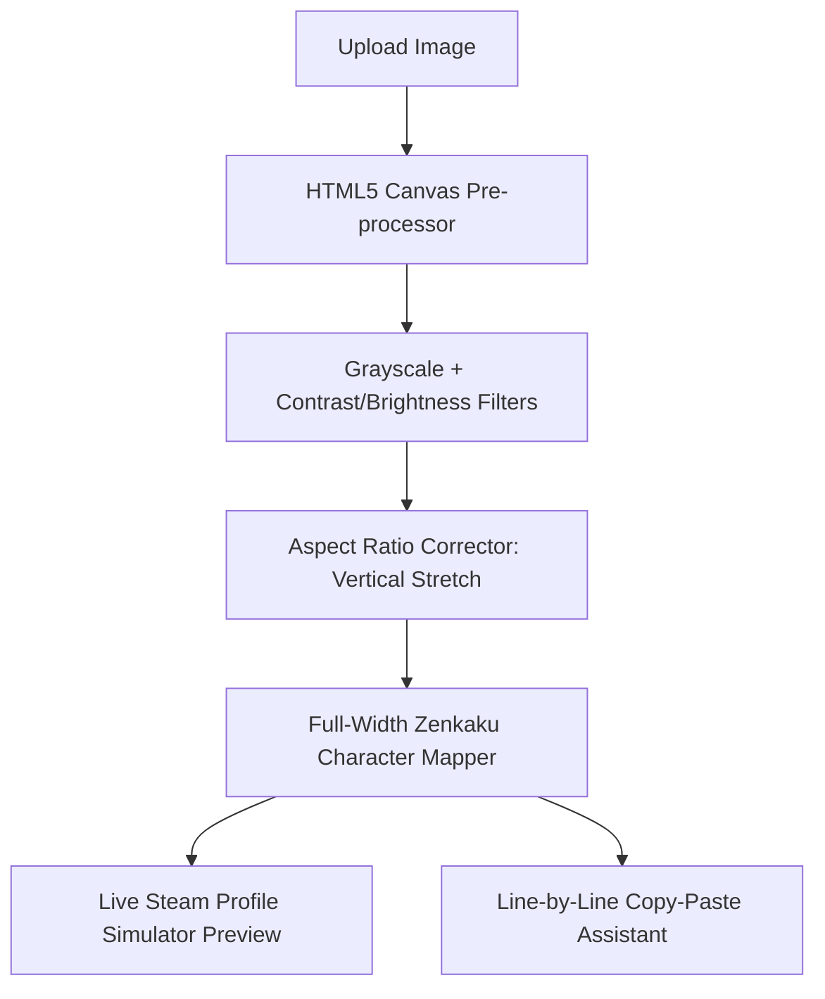

# Implementation Plan: Steam Profile ASCII Art Generator

Steam's "Custom Info Box" profile showcase uses a font that is **not monospaced** for standard ASCII characters. This causes standard ASCII art to stretch, skew, and break. 

The community's current workaround is highly tedious and manual:
1. Generate standard ASCII from an image using a legacy generator.
2. Paste into Google Docs and set the font to **Courier New**.
3. Manually delete the trailing spaces from the bottom up on every line (otherwise Steam breaks line wrapping).
4. Run standard characters through a translator (like `dencode.com`) to convert them to **Full-Width Zenkaku Unicode characters** (e.g. `　`, `■`), which are rendered as square, uniform blocks on Steam.
5. Manually copy and paste every line one-by-one into the Steam client.

This plan outlines a **single-page web application** (HTML5 Canvas + Tailwind CSS + Svelte or Vanilla JS) that automates the entire process in one click.

---

## App Architecture & Core Flow



### 1. Canvas Pre-Processing & Filters
* **Responsive Canvas resizing**: Shrinks the uploaded image to exactly `46` or `47` pixels in width (the strict character limit of Steam showcases).
* **Grayscale Conversion**: Uses standard luminosity formulas `0.299R + 0.587G + 0.114B` to convert the color data.
* **Canvas-based CSS Filters**: Adjusts brightness, contrast, and inversion controls in real-time, allowing users to fine-tune image edges for low-resolution ASCII conversion.

### 2. The Zenkaku Monospaced Mapping Engine
* Replaces standard variable-width characters (like standard spaces ` ` and punctuation) with full-width Zenkaku characters, which are natively treated as monospaced squares on Steam.
* Trims trailing spaces (`　`) at the end of every line automatically, preventing broken layout wraps.
* Pre-defines character palettes ranging from light to dark values:

| Palette Name | Unicode Blocks Used (Light to Dark) | Best For |
| :--- | :--- | :--- |
| **Standard Text** | `　`, `．`, `：`, `＋`, `＊`, `＃`, `％`, `＠`, `■` | Detailed, high-contrast outlines |
| **Blocks (Dithered)** | `　`, `░`, `▒`, `▓`, `█` | Shaded silhouettes & retro graphics |
| **Solid High-Contrast** | `　`, `■` | Solid silhouettes, icons, and logos |

### 3. Vertical Aspect-Ratio Stretching (Anti-Squish)
Because Steam's line-height in showcases is taller than the character width, standard square blocks will look squished vertically. The app includes a **Vertical Stretch Slider** (ranging from `1.0x` to `2.5x`) that resizes the Canvas height prior to character mapping to restore correct aspect ratios.

### 4. Interactive Keyboard Copy-Paste Assistant
To copy blocks into the Steam client without carriage-return issues, the app includes a **Copy Helper panel**:
* Highlights the current active line.
* Pressing **`Space`** or **`Enter`** copies the current line to the clipboard and automatically jumps to the next line.
* Features a progress counter (e.g., `Line 12 / 40`) and keyboard focus visualizers.

---

## Code Reference & Implementation Details

### Pixel-to-Zenkaku Generator Algorithm
This script processes the image data directly, applies filters, performs aspect stretching, and generates the finalized Zenkaku text.

```javascript
/**
 * Processes an HTML Image element into Steam-compatible monospaced ASCII art.
 */
function generateSteamAscii(imageEl, {
  width = 46,
  stretchFactor = 1.7,
  palette = ["　", "．", "：", "＋", "＊", "＃", "％", "＠", "■"],
  brightness = 0,
  contrast = 1.0,
  invert = false
}) {
  const canvas = document.createElement('canvas');
  const ctx = canvas.getContext('2d');
  
  // Calculate stretched height to offset Steam's line height squish
  const originalAspect = imageEl.naturalHeight / imageEl.naturalWidth;
  const targetHeight = Math.round(width * originalAspect * stretchFactor);
  
  canvas.width = width;
  canvas.height = targetHeight;
  
  // Draw the image onto the low-resolution canvas
  ctx.drawImage(imageEl, 0, 0, width, targetHeight);
  const imgData = ctx.getImageData(0, 0, width, targetHeight);
  const pixels = imgData.data;
  
  let result = [];
  for (let y = 0; y < targetHeight; y++) {
    let lineChars = [];
    for (let x = 0; x < width; x++) {
      const idx = (y * width + x) * 4;
      const r = pixels[idx];
      const g = pixels[idx + 1];
      const b = pixels[idx + 2];
      
      // Calculate grayscale value
      let gray = 0.299 * r + 0.587 * g + 0.114 * b;
      
      // Apply contrast and brightness adjustments
      gray = ((gray - 128) * contrast) + 128 + brightness;
      gray = Math.max(0, Math.min(255, gray));
      
      if (invert) {
        gray = 255 - gray;
      }
      
      // Map grayscale intensity to character palette
      const charIdx = Math.floor((gray / 255) * (palette.length - 1));
      lineChars.push(palette[charIdx]);
    }
    
    // Automatically strip trailing full-width space blocks to protect margins
    let lineStr = lineChars.join('');
    while (lineStr.endsWith('　')) {
      lineStr = lineStr.slice(0, -1);
    }
    result.push(lineStr);
  }
  
  return result.join('\n');
}
```

### The Keyboard Copy-Assistant Component
A Svelte or vanilla JS state component to make pasting lines into the Steam client fluid.

```javascript
let lines = []; // array of ASCII strings from generateSteamAscii
let currentIndex = 0;

function copyLine(index) {
  if (index < 0 || index >= lines.length) return;
  navigator.clipboard.writeText(lines[index]).then(() => {
    // UI Visual feedback trigger here
    if (currentIndex < lines.length - 1) {
      currentIndex++;
    }
  });
}

// Global window event listener for hands-free copying
window.addEventListener('keydown', (e) => {
  if (e.code === 'Space' && e.ctrlKey) {
    e.preventDefault();
    copyLine(currentIndex);
  }
});
```

---

## User Interface Design

1. **Upload Zone**: Drag-and-drop file target with custom resolution controls.
2. **Interactive Controls Sidebar**:
   * Character Width (`46` / `47` toggle).
   * Vertical Stretch slider (`1.0x` - `2.5x`).
   * Grayscale filters (Contrast, Brightness, Invert checkboxes).
   * Character Palette selector.
3. **Live Simulator Screen**:
   * A container styled to match Steam’s profile page: background color `#171a21` (dark charcoal), font-family `Motiva Sans, Arial, sans-serif`, and specific padding rules.
   * Renders the ASCII art exactly as it will appear inside the Steam browser client.
4. **Copy Dashboard**:
   * List of generated lines with click-to-copy handlers and a "Current Line Highlight" block.
